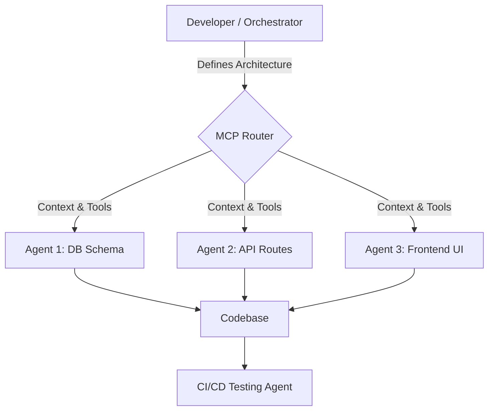

# From AI Assistance to Agentic Workflows: The Developer's Role in 2026

> [!summary] TL;DR
> In 2026, software development is rapidly shifting from using AI as a simple autocomplete tool to embracing **agentic workflows**. Developers are transitioning into orchestration roles, utilizing autonomous AI agents connected via the Model Context Protocol (MCP) to manage end-to-end development lifecycles.

The landscape of software engineering has irrevocably changed. We've officially moved past the era where AI was merely a fast auto-completer. Today, the focus is squarely on **agentic workflows**—systems where specialized AI agents autonomously handle complex, multi-step engineering tasks.

Whether you're building a massive microservices backend or optimizing a React frontend, integrating agentic workflows into your daily routine is no longer optional; it's a fundamental requirement for remaining competitive.

## What Are Agentic Workflows?

Agentic workflows represent a paradigm shift in how we approach coding. Instead of manually writing every line, a developer acts as the system orchestrator. You define the high-level architecture, business logic constraints, and security requirements, while AI agents handle the boilerplate, refactoring, and test generation.

> [!tip] Pro Tip
> Don't try to use one massive prompt for an entire feature. Break your architecture down into domain-specific tasks and assign them to specialized agents (e.g., a dedicated routing agent, a dedicated database schema agent).

This shift has given rise to the concept of "vibe coding," where the human focus is entirely on system design, prompt engineering, and rigorous validation rather than syntax memorization.

## The Role of the Model Context Protocol (MCP)

A major hurdle in early AI integration was tool fragmentation. This problem is being rapidly solved by the **Model Context Protocol (MCP)**. 

MCP has emerged as the de facto standard for standardizing how AI models connect to external tools, local file systems, and enterprise databases. By providing a unified interface, MCP allows diverse agentic workflows to operate seamlessly across your entire development stack without needing custom integrations for every new AI tool.

## How to Prepare for the Future

To thrive in an environment dominated by agentic workflows, you need to adapt your skillset. 

1. **Master Prompt Engineering:** Writing precise, constraint-based prompts is the new syntax.
2. **Focus on System Architecture:** Understanding how distributed systems interact is more crucial than ever. Check out our guide on [[Microservices Architecture Patterns]] for a refresher.
3. **Prioritize Security (DevSecOps):** With AI writing more code, human oversight on security vulnerabilities (Zero-trust models) is paramount. Read more in [[Zero-Trust DevSecOps]].

## Conclusion

The transition toward **agentic workflows** is empowering developers to build faster, scale higher, and focus on creative problem-solving rather than rote implementation. By embracing MCP and shifting your mindset toward orchestration, you position yourself at the cutting edge of the 2026 tech industry.

It's time to stop just writing code—start orchestrating it.

---

### Frequently Asked Questions

**What is the difference between AI assistance and agentic workflows?**
AI assistance typically involves reactive tools like code completion (e.g., early Copilot). Agentic workflows involve autonomous agents that can plan, execute, and verify multi-step tasks independently.

**Do I need to learn a specific language for MCP?**
No, the Model Context Protocol is language-agnostic. However, strong foundations in TypeScript, Python, or Go are highly beneficial for building custom MCP servers.

**Will agentic workflows replace developers?**
No. They eliminate repetitive coding, allowing developers to focus on higher-level system architecture, security, and complex business logic validation.

---
*Sources & Image Attributions:*
*Image by [Christopher Gower](https://unsplash.com/photos/m_HRfLhgABo) on Unsplash.*
