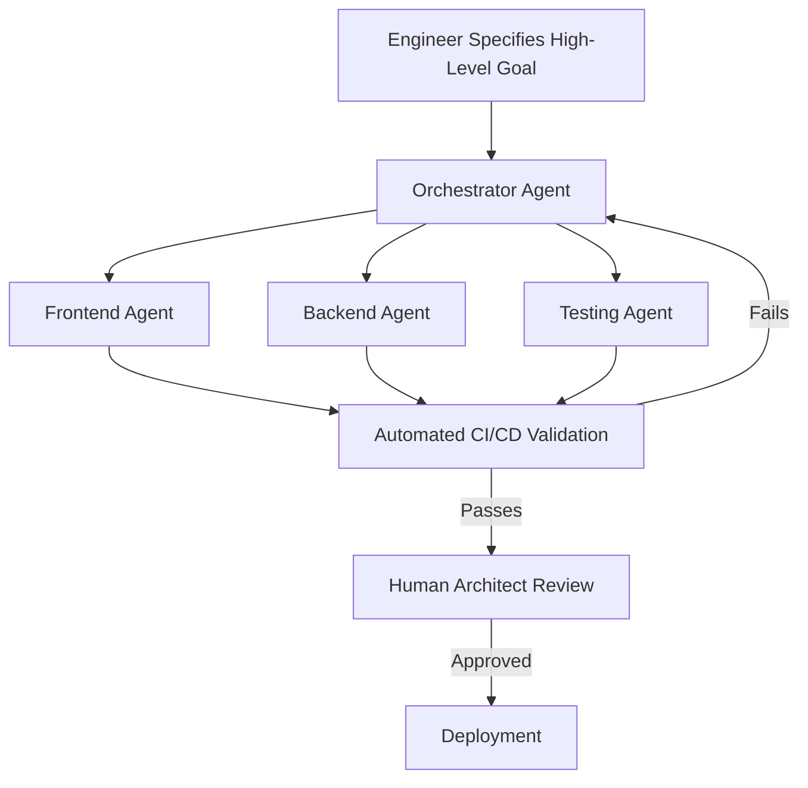

# The Next Bottleneck: Navigating Agentic Coding Trends in 2026

> [!summary] TL;DR
> In 2026, the core of software development is shifting. Developers are moving away from manual coding towards **Agentic Coding**—the orchestration of autonomous AI agents. The new bottleneck isn't writing code, it's managing, verifying, and integrating the outputs of these agents at scale.

The software development landscape has evolved rapidly over the past few years, and **Agentic Coding Trends 2026** point to a massive paradigm shift. As organizations scale their use of artificial intelligence, developers are no longer just writing syntax. Instead, they are stepping into the role of orchestrators, managing multiple AI agents to build complex systems. 

This shift in **AI software engineering** brings unprecedented speed but introduces entirely new bottlenecks and challenges for engineering teams.

## The Rise of Agentic Coding

Agentic coding refers to the practice of delegating complex development tasks to autonomous or semi-autonomous AI agents. Rather than utilizing Copilot-style autocomplete, engineers in 2026 provide high-level goals, and the agents handle the implementation, testing, and sometimes even the deployment.

However, as reported by engineering leaders recently, bridging the gap between early experimental success and organization-wide adoption is proving difficult. 

## Why AI Software Engineering is Facing a Bottleneck

While AI generates code faster than ever, human review processes, security audits, and system integration are struggling to keep up. The new **AI bottlenecks** are centered around:

1. **Context Limits:** Agents struggle to maintain architectural integrity across massive codebases.
2. **Review Fatigue:** Senior engineers spend more time reviewing AI-generated code than they would writing it themselves.
3. **Integration Failures:** Multiple agents working in silos can create code that works perfectly in isolation but fails upon integration.

> [!tip] Pro Tip
> To combat review fatigue, implement automated testing pipelines that validate an agent's code *before* a human ever sees it. Treat AI agents like junior developers who need a strict CI/CD guardrail.

### The Agentic Orchestration Process

To understand how developers are adapting, let's look at the modern workflow. 

## Mastering Code Orchestration

The most successful teams in 2026 are focusing on **code orchestration** rather than individual output. This means building systems that allow agents to communicate efficiently and ensuring that human oversight is reserved for high-level architectural decisions, not syntax debugging.

Building a robust internal framework for managing these agents is essential. Teams should explore concepts detailed in our guide on [[Building AI Driven Workflows]] and understand the broader [[Future of Software Engineering]].

## Conclusion: Adapting to Agentic Coding Trends 2026

The transition to agentic coding is inevitable, but it doesn't mean human engineers are obsolete. Instead, their roles are elevating. By understanding and anticipating the **Agentic Coding Trends 2026**, engineering leaders can unblock the new AI bottlenecks and empower their teams to orchestrate code at an unprecedented scale. 

Are you ready to shift from writing to orchestrating? Start by automating your testing frameworks and integrating agent-specific CI/CD pipelines today. For further reading, check out [[AI in Development]].

---
## FAQ

**Q: What is Agentic Coding?**
A: Agentic coding is the use of autonomous AI agents to write, test, and deploy software based on high-level goals rather than line-by-line human input.

**Q: Why is reviewing AI code the new bottleneck?**
A: AI can generate code instantly, overwhelming the human engineers who must review it for architectural consistency, security, and performance.

**Q: How can engineering teams adapt to these trends?**
A: Teams need to shift their focus from writing syntax to system architecture and code orchestration, implementing strict automated testing to validate AI outputs before human review.

---
### Sources & Image Attributions

- Image 1: [Unsplash - Clement Helardot](https://unsplash.com/photos/1555066931-4365d14bab8c)
- Image 2: [Unsplash - Annie Spratt](https://unsplash.com/photos/1522071820081-009f0129c71c)
