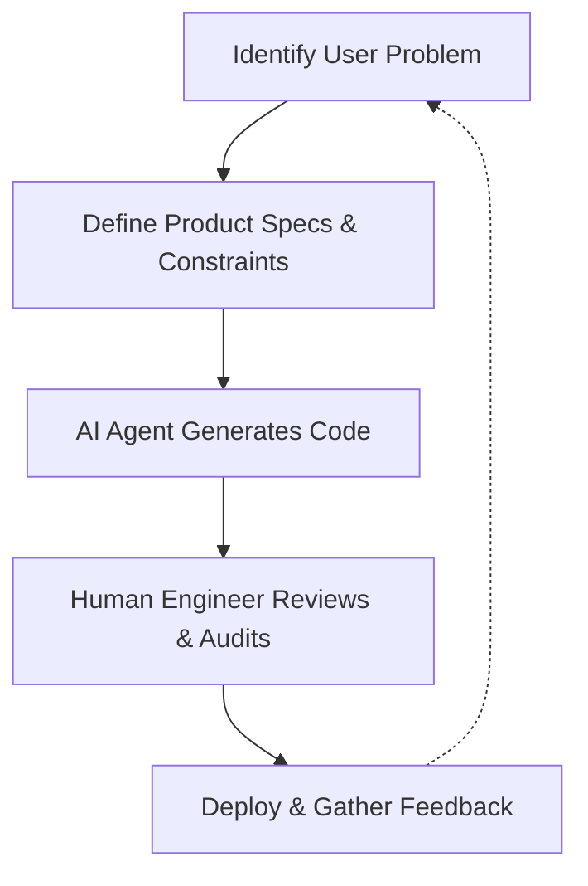

# Why AI Coding Agents Require Product Thinking

> [!summary] TL;DR
> As **AI coding agents** become more capable, the bottleneck in software development is shifting from writing code to defining what to build. Engineers who embrace **product thinking** and spec-driven development will thrive in this new era, transitioning from pure coders to system architects and product strategists.

The software engineering landscape is experiencing a seismic shift. We are moving away from an era where writing boilerplate and maintaining legacy systems consumed most of our time. Today, the rise of **AI coding agents product thinking** is becoming the most critical skill for modern developers. 

As tools like Claude Code and GitHub Copilot Workspace automate the implementation details, the real value of an engineer is no longer just in producing lines of code. It's in understanding user needs, defining clear specifications, and thinking holistically about the product.

## The Rise of AI Coding Agents: From Coders to Thinkers

In the past, developers spent hours translating business requirements into syntax. Today, **generative AI software development** tools have commoditized basic coding tasks. 

> [!tip] Pro Tip
> Don't fight the AI by focusing on syntax. Instead, focus on architectural patterns, edge cases, and the overall user experience. This is where human intuition still heavily outperforms machines.

This means that engineers are effectively being promoted to technical product managers. When AI can generate the code, your job is to ensure it generates the *right* code. 

### What is Product Thinking in Engineering?

Product thinking means starting with the problem rather than the technical solution. It involves asking:
*   **Who** is this feature for?
*   **Why** do they need it?
*   **How** does this fit into the broader system architecture?

By integrating product thinking into your workflow, you bridge the gap between business objectives and technical execution. You can read more about this transition in our guide on [[The Future of AI Engineering]].

## How AI Coding Agents Elevate Product Thinking

When you pair **AI coding agents** with strong **product thinking**, you unlock unprecedented velocity. Here is how this dynamic changes the development lifecycle:

### 1. Spec-Driven Development

We are entering the age of **spec-driven development**. Instead of manually typing out logic, engineers write comprehensive specifications. The AI acts as the compiler, turning those specs into functional code. This requires a deep understanding of product requirements. Learn more in our post on [[Spec-Driven Development]].

### 2. Accelerated Prototyping

With **AI software engineering**, the cost of prototyping drops to near zero. You can test ideas quickly, gather user feedback, and iterate. The focus shifts from "How long will this take to build?" to "Is this the right thing to build?"

### The New Development Workflow

## Embracing the Future of AI Software Engineering

To stay relevant, developers must adapt. Writing code is just one part of the job; understanding the product is the ultimate differentiator. By combining the execution speed of AI with human empathy and strategic vision, we can build better software faster than ever before.

As you navigate this transition, consider improving your prompt skills with our [[Prompt Engineering for Devs]] resource. The future belongs to those who know what to ask for.

## Frequently Asked Questions (FAQ)

**Q: Will AI replace software engineers?**
A: No, but it will change the nature of the job. Engineers will spend less time typing code and more time on system design, architecture, and product strategy.

**Q: What is spec-driven development?**
A: It is a methodology where developers write detailed specifications (prompts, diagrams, requirements) and use AI tools to generate the underlying code, focusing on the "what" rather than the "how".

**Q: How can I develop product thinking skills?**
A: Start by talking to users, understanding business metrics, and questioning the "why" behind feature requests before writing any code.

---

**Sources & Image Attributions**
*   Header Image: [Unsplash - Coworking Space](https://unsplash.com/photos/group-of-people-sitting-indoors-gMsnXqILmL4)