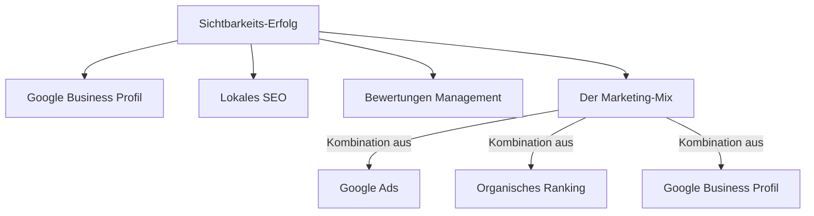

# Warum eine Lokale SEO Strategie heute wichtiger ist als Klassisches SEO

> [!summary] TL;DR
> Monatelange Optimierung und perfekter Code reichen oft nicht mehr für Platz 1. Eine moderne **Lokale SEO Strategie**, kombiniert mit einem gepflegten Google Business Profil und echten Kundenbewertungen, ist der sicherste Weg, um online sichtbare Erfolge zu erzielen.

Monatelange Optimierung. Sorgfältig gewählte Keywords. Schlanker Code, schnelle Ladezeiten.

Und dann? Kein Platz „above the fold“, keine Sichtbarkeit auf der heiß umkämpften ersten Google-Seite. Kommt Ihnen das bekannt vor? So oder ähnlich geht es vielen Unternehmen, die viel Zeit, Budget und Energie in klassisches SEO investieren – und trotzdem kaum Ergebnisse sehen. Der digitale Wettbewerb ist härter geworden. Aber ist organisches SEO damit überholt?

Lassen Sie uns gemeinsam einen genaueren Blick auf die Realität werfen – und herausfinden, was sich für eine nachhaltige **Lokale SEO Strategie** wirklich lohnt.

## Der Platz an der Sonne? Meist längst vergeben.

Suchen Sie selbst nach einem klassischen Begriff bei Google, was sehen Sie sehr oft zuerst?

**Meistens nicht das beste organische Suchergebnis.** Sondern:
- Google Ads Anzeigen
- Shopping-Vorschläge
- Google Maps-Einträge
- Und dann noch Boxen wie Karten und „Nutzer fragen auch“

All das **noch vor** den klassischen Suchtreffern. Die Folge: **Weniger als 50 % der „Page One“ gehören überhaupt noch den organischen Ergebnissen.** Und diesen kleinen Raum teilen sich unzählige Anbieter – mit zunehmendem Konkurrenzdruck. Schauen Sie sich dazu die von mir durchgeführten Beispiele für die Suche nach "Rechtsanwalt Berlin", "Küchen Berlin" und "Bürodrucker Berlin" an.

> [!info] Hinweis zur Sichtbarkeit
> Oft sind die ersten Bildschirmzentimeter gefüllt mit gesponserten Inhalten (Rot), Google Business Einträgen und Karten (Gelb) sowie weiteren Fragen (Blau).

## Zeit umzudenken – und umzusteuern.

Keine Sorge: **SEO ist nicht tot.** Aber es hat sich verändert. Und wer heute mitspielen will, sollte mehr denn je strategisch denken. Hier sind fünf Hebel für Ihre **Lokale SEO Strategie**, die wirklich etwas bewegen – und die Sie direkt angehen können:

### 1. Google Business Profil: Ihre kostenlose Sichtbarkeits-Maschine
Google belohnt gepflegte Business-Profile. Die Einträge erscheinen prominent – oft sogar ganz oben. Und das Beste: Es kostet nichts außer ein wenig Aufmerksamkeit. Wer hier regelmäßig postet, Öffnungszeiten, Produkte, News und Artikel aktuell hält und mit Kunden interagiert, wird schnell mit mehr Sichtbarkeit und Vertrauen belohnt.

### 2. Lokales SEO – so einfach wie effektiv
Gerade wenn Sie lokal arbeiten, kann ein starker Fokus auf regionale Sichtbarkeit Wunder wirken. Eintragungen in Online-Branchenverzeichnisse, lokale Keywords und Verlinkungen machen Ihr Unternehmen **relevant für die Menschen vor Ort – und für Google.**

### 3. Bewertungen, die Vertrauen schaffen
Menschen glauben Menschen. Und Google liebt Bewertungen. Pflegen Sie Ihr Bewertungsmanagement – bitten Sie aktiv um Feedback, antworten Sie zeitnah persönlich und zeigen Sie sich nahbar. Gute Bewertungen bringen Sie nicht nur nach vorne – sie erhöhen auch Ihre Conversion. Für mehr Tipps dazu, schauen Sie in unseren Artikel zum Thema [[Online Reputation Management]].

### 4. Der Mix macht’s: Sichtbar aus mehreren Richtungen
Die ideale Kombination? Google Ads, ein starkes organisches Ranking und ein aktives Google Business Profil. So können Sie gleich mehrfach in den Ergebnissen auftauchen – und bleiben besser im Gedächtnis.

### 5. Erfüllen Sie die Erwartungen – oder verlieren Sie Besucher
Ihr Auftritt auf Google ist nur der Anfang. Wer klickt, landet auf Ihrer Website oder Ihrem Onlineshop. Und dort entscheidet sich, ob Interesse zur echten Anfrage wird. Sorgen Sie für einen stimmigen Auftritt, klares Design, schnelle Ladezeiten – und vor allem: Emotion. Lesen Sie hier mehr über [[Website Conversion Optimierung]].

## Fazit: Weniger kämpfen – gezielter handeln.

Sie müssen nicht lauter sein als alle anderen. Sie müssen nur **präziser** und **smarter** sein. Klassisches SEO allein reicht nicht mehr. Aber in Kombination mit einer klaren **Lokale SEO Strategie**, effektiven Google Tools und echtem Nutzerfokus eröffnen sich völlig neue Chancen.

Neugierig, wie Ihr Unternehmen sichtbarer werden kann – ohne sich im SEO-Dschungel zu verlieren? Starten Sie noch heute mit der Optimierung Ihres Google Business Profils.

---

### Frequently Asked Questions (FAQ)

**Ist klassisches SEO heute komplett nutzlos?**
Nein, klassisches SEO ist nicht nutzlos. Es bildet weiterhin das technische und inhaltliche Fundament Ihrer Website. Es muss heute jedoch um lokale SEO-Maßnahmen und Google Business Profile ergänzt werden, um wirklich sichtbar zu bleiben.

**Wie wichtig ist das Google Business Profil wirklich?**
Sehr wichtig! Für lokale Suchanfragen ist es oft der erste Touchpoint zwischen Kunde und Unternehmen. Ein optimiertes Profil kann mehr Leads generieren als das beste organische Ranking auf Platz 5 oder 6.

**Wie bekomme ich mehr Kundenbewertungen?**
Bitten Sie zufriedene Kunden proaktiv nach dem Kauf oder der Dienstleistung um eine Bewertung. Automatisierte E-Mails oder ein QR-Code im Geschäft können diesen Prozess enorm erleichtern.

---
*Sources & Image Attributions:*
*Images by [Carlos Muza](https://unsplash.com/photos/hpjSkU2UYSU) and [Blake Wisz](https://unsplash.com/photos/Xn5FbEM9564) on Unsplash.*