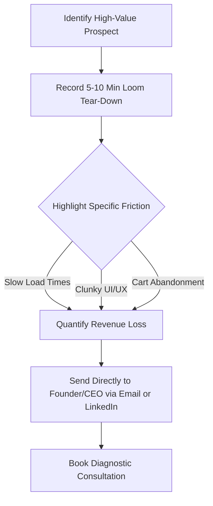

# The "Tear-Down & Close" Strategy: The Ultimate High-Ticket Freelance Developer Strategy

Are you tired of competing on Upwork for table scraps? If you want to land premium projects and scale your income, you need a proven **high-ticket freelance developer strategy**. 

Freelance full-stack developers and agency owners often struggle because they position themselves as commodities. To stop competing on price, dominate local markets, and land premium clients, you must fundamentally change your approach to lead generation and sales.

To successfully transition into the premium market, you must master three core pillars:
- **Targeted Lead Generation:** Sourcing clients who value financial outcomes over hourly rates.
- **Expert Positioning:** Eliminating generalist titles in favor of highly specialized, complex skill sets.
- **Value-Based Sales:** Structuring the close around business ROI, not technical features.

This article provides an authoritative, actionable blueprint to transform your freelance web development business.

## Phase 1: High-Ticket Freelance Developer Strategy for Finding the Right Clients (Lead Generation)

Your pipeline determines your power. The most effective **high-ticket freelance developer strategy** starts by proactively targeting businesses with existing cash flow and glaring digital bottlenecks. 

### The "Tear-Down" Outreach Strategy

The days of cold email blasts are over. Instead, use the **"Tear-Down" outreach strategy** to instantly demonstrate value. 

Spend 5-10 minutes recording a Loom video reviewing a prospect's digital storefront. Highlight specific areas of friction—such as slow load times, clunky UI, or cart abandonment issues. 

Send this video directly to the founders. By offering an unsolicited, high-value audit, you cut through the noise and position yourself as a strategic partner rather than just another developer. This is the cornerstone of effective [[Loom Video Outreach]].

> [!tip] Pro Tip
> Don't just point out flaws. Quantify the loss. Say, *"This 3-second load delay on the checkout page is likely costing you 15% of your mobile conversions,"* to make the business pain tangible.

### Dominate the Regional Market

In a globalized world, local trust is your ultimate competitive advantage. Many established businesses have been burned by cheap, remote agencies and are willing to pay a premium for a local partner they can shake hands with.

Leverage your geography. Attend local business association meetings, sponsor regional tech events, and tailor your outreach to companies in your specific state or city. 

By prioritizing local relationships, you instantly outcompete faceless offshore firms and establish a high-trust foundation necessary for freelance developer lead generation.

### Weaponize the Tech Stack Niche

Generalists compete on price; specialists dictate their terms. Avoid vague titles like "Web Developer." Instead, position yourself exclusively as a **VILT stack expert** (Vue, Inertia, Laravel, Tailwind) or **RILT stack development** specialist (React instead of Vue).

Focus your messaging strictly on your ability to build complex custom dashboards and Single Page Applications (SPAs) that off-the-shelf solutions simply can't handle. 

When you weaponize your tech stack niche, you attract clients who understand they are paying for specialized software architecture. This allows you to seamlessly introduce [[Value-Based Pricing]] into your negotiations.

## Phase 2: Executing Your High-Ticket Freelance Developer Strategy (The Close)

Getting them on the call is only half the battle. The closing phase of your **high-ticket freelance developer strategy** must reinforce your authority and demonstrate undeniable competence. 

### Lead with the Diagnostic Consultation

When you get a prospect on a call, stop talking about your favorite frameworks. Instead, lead with a diagnostic consultation. Act as a "business doctor." 

Focus entirely on their bottlenecks, the time their team is wasting, and their overarching revenue goals. Use your [[Diagnostic Consultation Framework]] to dig deep into the financial impact of their current problems.

> [!warning] The Takeaway
> Never quote an hourly rate. Diagnose the business problem, prescribe a technical solution, and price the project based on the value generated. Utilize value-based pricing software to structure and present your premium proposals.

### Leverage High-Fidelity Proof

To close premium deals, you must eliminate all doubt about your competence. Words are cheap; high-fidelity proof is undeniable.

Showcase cinematic, high-performance past work. Don't just link to a live site that the client might have ruined with massive image uploads over time. 

Instead, provide high-resolution video walkthroughs of the complex dashboards and SPAs you've built. Demonstrate the raw speed, the sleek UI, and the seamless user experience of your past projects to visually justify your premium rates.

### The "Takeaway" Close

The most powerful negotiation tactic is the genuine willingness to walk away. The "Takeaway" close is essential for maintaining authority.

Set strict boundaries on price and scope early in the conversation. If a client balks at your pricing or asks for a "standard template" instead of a custom solution, respectfully decline the project. 

Telling a client, *"It sounds like you need a simple templated site, which isn't what we specialize in. I'm happy to refer you to an agency that handles budget builds,"* establishes ultimate authority and often makes them want your services even more.

## Conclusion

Transitioning from an overworked generalist to a premium consultant requires a fundamental shift in how you acquire and close clients. 

By fully implementing this **high-ticket freelance developer strategy**, conducting targeted Loom tear-downs, dominating your regional market, and acting as a diagnostic expert, you will stop competing on price and start commanding the rates you deserve. Stop selling code, and start selling high-leverage business transformations.

**Call to Action:** Ready to overhaul your lead generation? Pick three local businesses with obvious digital bottlenecks today, record your first 5-minute Loom tear-down, and send it directly to the founder. 

## Frequently Asked Questions (FAQ)

**Q: How long should my Loom outreach videos be?**
A: Keep them concise and highly impactful, ideally between 5 to 10 minutes. Focus entirely on identifying specific points of friction on their platform and quantifying the potential revenue lost because of those issues.

**Q: Why should I focus on a specific tech stack like VILT or RILT?**
A: Specializing in a robust stack like VILT or RILT positions you as an expert capable of building complex, high-performance web applications. This justifies premium pricing and separates you from "generalist" developers using basic drag-and-drop website builders.

**Q: What is the main goal of the diagnostic consultation?**
A: The absolute primary goal is to uncover the financial impact of the client's problem. You want to completely shift the conversation away from technical features and hourly rates toward business outcomes, time saved, and overall revenue generated.

---
### Sources & Image Attributions
- [Developer analyzing code image by Christopher Gower on Unsplash](https://unsplash.com/photos/a-man-typing-on-a-macbook-m_HRfLhgABo)
- [Team discussing strategy image by Austin Distel on Unsplash](https://unsplash.com/photos/group-of-people-sitting-indoors-rxpThOwuVgE)